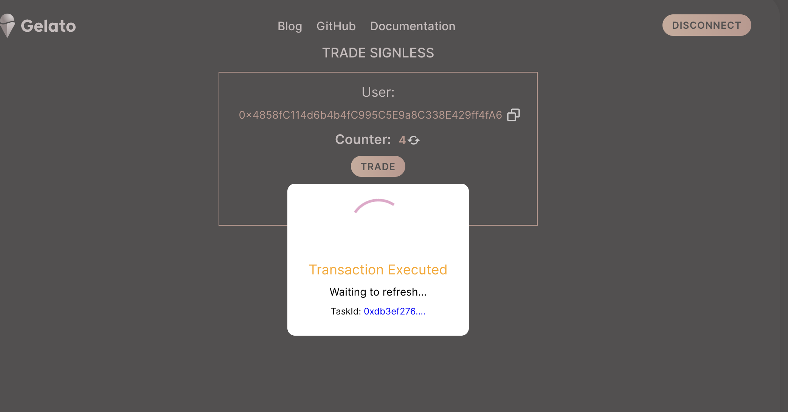

# Session Key UI
This project showcases how to use Session Keys to enable Signless Ux.

## Web3 App
[https://signless-trade.web.app/](https://signless-trade.web.app/)

 

When enabling Signless the webapp will:
- Check if there are already sessionkeys available in the browser
- Check if these keys are still vaild
- Create new session keysif needed
- Use session keys to sign following transactions 

Interesting code parts:
- Creating session Keys [here](/src/components/App/index.tsx#L452)
- Signless Transaction [here](/src/components/App/index.tsx#L190)


 ## Get Started
 ```
 yarn start
 ```